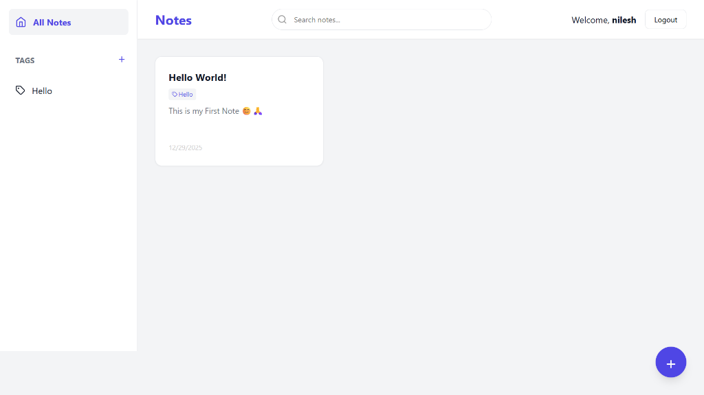
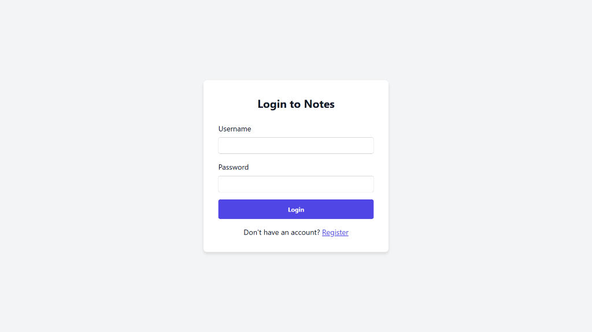
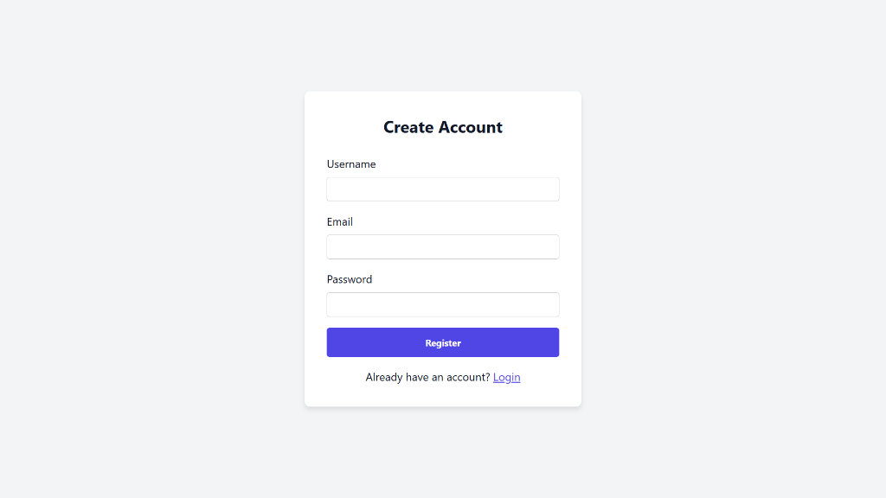
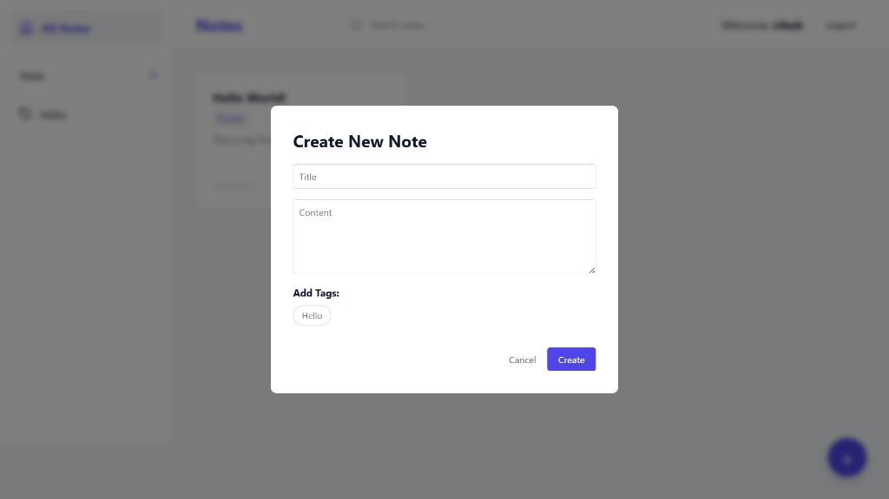

# 📝 Notes App

A modern, full-stack note-taking application built with **Go (Golang)** and **React**. Designed to demonstrate clean architecture, secure authentication, and a polished user interface.



## ✨ Features

- **🔐 Secure Authentication**: User registration and login powered by **Paseto** tokens and **Argon2** password hashing.
- **📝 CRUD Operations**: Create, Read, Update, and Delete notes.
- **🏷️ Tagging System**: Organize notes with custom tags. Filter notes by tag.
- **🔍 Search**: Instant search functionality to find notes by title or content.
- **💅 Modern UI**: Responsive design with a glassmorphism aesthetic using vanilla CSS and React.
- **🐳 Dockerized**: Fully containerized with Docker Compose for easy deployment.

## 🛠️ Tech Stack

### Backend
- **Language**: Go (Golang)
- **Framework**: Gin
- **Database**: PostgreSQL
- **SQL Generation**: sqlc
- **Migrations**: golang-migrate
- **Authentication**: PASETO (Platform-Agnostic Security Tokens)

### Frontend
- **Framework**: React (Vite)
- **Styling**: Vanilla CSS (Variables, Flexbox/Grid)
- **HTTP Client**: Axios
- **Icons**: Lucide React

### DevOps
- **Docker**: Multi-stage builds for optimized images.
- **Docker Compose**: Orchestration for API, Database, and Frontend services.

## 🚀 Getting Started

### Prerequisites
- [Docker](https://www.docker.com/) and Docker Compose installed on your machine.

### Installation

1.  **Clone the repository:**
    ```bash
    git clone https://github.com/nilesh0729/Notes.git
    cd Notes
    ```

2.  **Start the application:**
    ```bash
    docker-compose up --build
    ```

3.  **Access the app:**
    - Frontend: `http://localhost`
    - API: `http://localhost:8080`

## 📸 Screenshots

| Login | Register |
|:---:|:---:|
|  |  |

| Create Note | Dashboard |
|:---:|:---:|
|  |  |

## 🧪 Testing

To run the backend tests:

```bash
go test -v ./...
```

## 📂 Project Structure

```
.
├── cmd/api             # Application entrypoint
├── internal
│   ├── api             # HTTP Handlers and Routes
│   ├── db              # Database access logic (generated by sqlc)
│   ├── tokens          # Authentication logic (Paseto/JWT)
│   └── util            # Configuration and helpers
├── frontend            # React application
├── screenshots         # Project screenshots
├── Dockerfile          # Backend Dockerfile
├── docker-compose.yaml # Docker Compose configuration
└── sqlc.yaml           # SQLC configuration
```

## 📜 License
This project is open source and available under the [MIT License](LICENSE).
